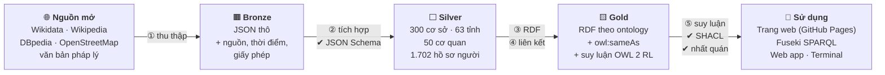
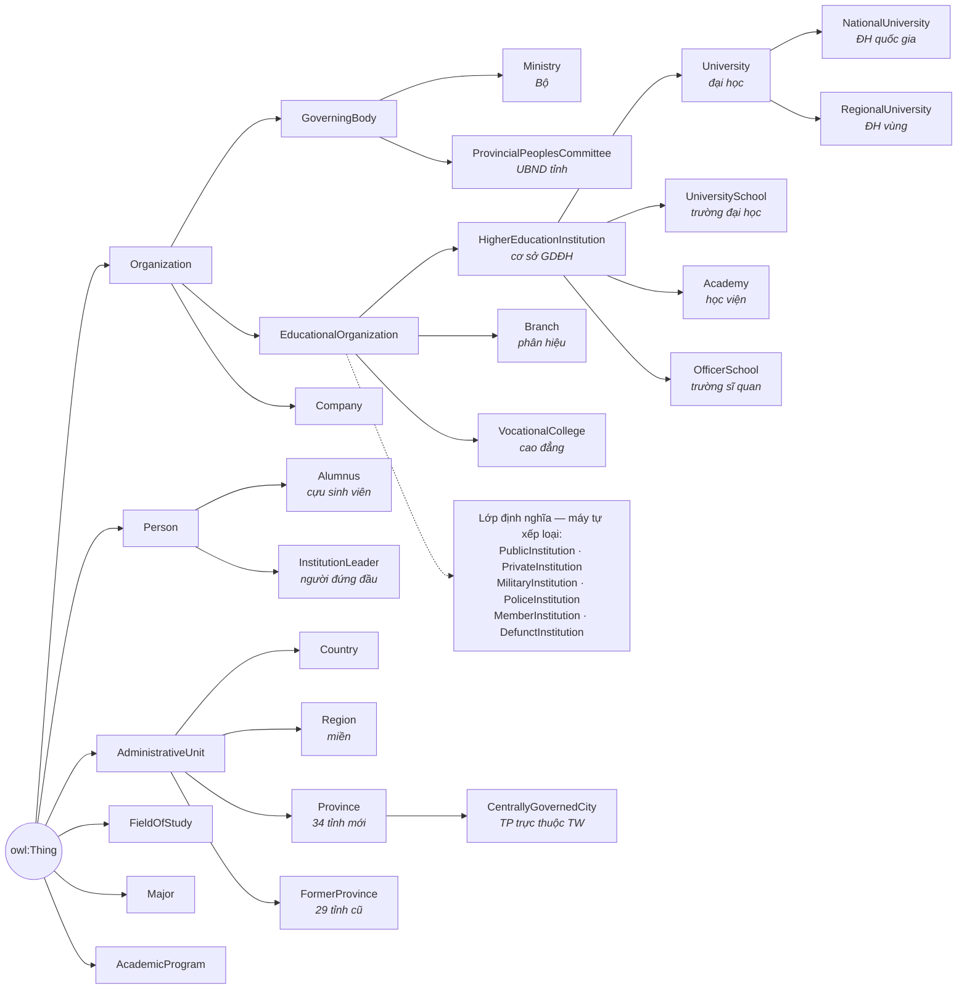
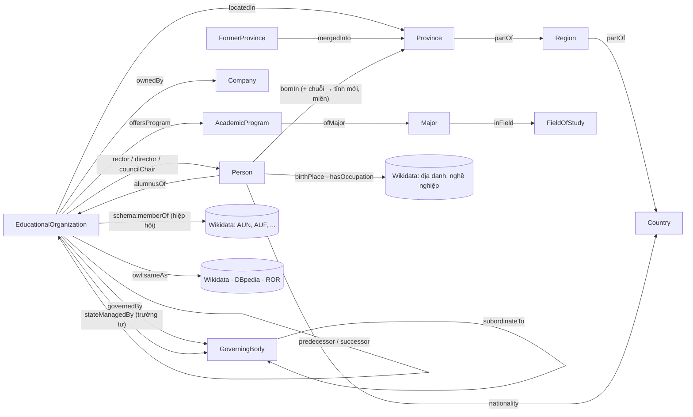

# 🎓 VN-Edu LOD — Dữ liệu liên kết mở về giáo dục đại học Việt Nam

[](https://github.com/pham-ng/Vietnam-University-Knowledge-Graph-ver2/actions/workflows/pages.yml)
 

**Bản rà soát 06/10/2026:** xem [kết quả audit và giới hạn còn lại](docs/independent-audit.md),
[báo cáo tiếng Anh đã hiệu chỉnh](docs/report/main-en.pdf), và [số liệu sinh từ bản dữ liệu đã kiểm định](data/reports/audit-metrics.json).
Kết quả kiểm định cấu trúc không phải chứng nhận độ chính xác thực tế. Đánh giá liên kết hiện đo mức khớp với tập tham chiếu do dự án tạo;
không có bằng chứng độc lập cho độ chính xác 100%. Báo cáo tiếng Việt cũ và các so sánh lịch sử được giữ làm tài liệu lưu trữ.

**VN-Edu LOD** là một đồ thị tri thức (knowledge graph) về **300 cơ sở giáo dục Việt Nam**, trong đó 271 được hệ thống phân loại là cơ sở GDĐH,
hướng tới các thực hành **Linked Open Data 5 sao**. Dữ liệu được thu thập từ Wikidata và Wikipedia tiếng Việt, đối chiếu chéo, chuyển sang RDF
theo một ontology OWL, suy luận tự động, kiểm định chất lượng, rồi liên kết tới Wikidata, DBpedia, ROR, GeoNames.

<p align="center">
  <a href="https://pham-ng.github.io/Vietnam-University-Knowledge-Graph-ver2/"><b>🌐 Xem trang web</b></a> ·
  <a href="https://pham-ng.github.io/Vietnam-University-Knowledge-Graph-ver2/map">🗺️ Bản đồ</a> ·
  <a href="https://pham-ng.github.io/Vietnam-University-Knowledge-Graph-ver2/explore">🔎 Tra cứu</a> ·
  <a href="https://pham-ng.github.io/Vietnam-University-Knowledge-Graph-ver2/ontology">🌳 Cây ontology</a> ·
  <a href="https://pham-ng.github.io/Vietnam-University-Knowledge-Graph-ver2/sparql">⚡ SPARQL</a> ·
  <a href="https://pham-ng.github.io/Vietnam-University-Knowledge-Graph-ver2/demo">🎬 Kịch bản demo</a>
  <br><a href="https://vnedu-lod.onrender.com/"><b>🛰️ SPARQL endpoint công khai</b></a> — <code>https://vnedu-lod.onrender.com/sparql</code>
</p>

> **Thử ngay:** mở trang [Trường Đại học VinUni](https://pham-ng.github.io/Vietnam-University-Knowledge-Graph-ver2/resource/university/truong-dai-hoc-vinuni)
> (infobox, giới thiệu, lịch sử, đối tác) — hoặc thêm đuôi
> [`.ttl`](https://pham-ng.github.io/Vietnam-University-Knowledge-Graph-ver2/resource/university/truong-dai-hoc-vinuni.ttl)
> để nhận đúng dữ liệu đó dưới dạng RDF cho máy đọc.

---

## Mục lục

1. [Có gì trong dataset?](#1-có-gì-trong-dataset)
2. [Chạy thử trong 3 phút](#2-chạy-thử-trong-3-phút)
3. [Luồng chạy của chương trình](#3-luồng-chạy-của-chương-trình)
4. [Dữ liệu được biến đổi như thế nào? (ví dụ VinUni)](#4-dữ-liệu-được-biến-đổi-như-thế-nào-ví-dụ-vinuni)
5. [Cây ontology](#5-cây-ontology)
6. [Suy luận: máy tự biết thêm điều gì?](#6-suy-luận-máy-tự-biết-thêm-điều-gì)
7. [Thống kê](#7-thống-kê)
8. [Vì sao đạt 5 sao?](#8-vì-sao-đạt-5-sao)
9. [Cách dùng dữ liệu](#9-cách-dùng-dữ-liệu)
10. [Cấu trúc thư mục](#10-cấu-trúc-thư-mục)
11. [Hạn chế](#11-hạn-chế)

---

## 1. Có gì trong dataset?

| | |
|---|---|
| 🏫 **Cơ sở giáo dục** | **300** — trong đó **271 cơ sở giáo dục đại học** (trường đại học, học viện, đại học, trường sĩ quan) |
| 📍 **Địa giới hành chính** | 34 tỉnh/thành mới (từ 1/7/2025) + 29 tỉnh cũ đã sáp nhập + 3 miền |
| 👤 **Con người** | 1.702 hồ sơ người — 1.481 hồ sơ có quan hệ giáo dục, 221 hồ sơ lãnh đạo; hồ sơ trùng tên chưa có định danh được tách theo trường |
| 🏛️ **Cơ quan chủ quản** | 50 — các Bộ, UBND tỉnh, quân chủng/binh chủng, tập đoàn giáo dục |
| 🔗 **Triple RDF** | **48.492** triple phân biệt trong hợp của dữ liệu (22.931), liên kết (3.674), suy luận giữ lại (21.018), ontology và metadata; các tập có thể giao nhau |
| 🌍 **Liên kết ra ngoài** | 1.880 Wikidata · 1.188 Wikipedia · 260 DBpedia · 195 ROR · 63 GeoNames |

Với mỗi trường có: tên (vi/en/viết tắt/tên khác/tên cũ), mã tuyển sinh, loại hình, công lập hay tư thục, năm và ngày
thành lập, cơ quan chủ quản, trường thành viên, lãnh đạo, đối tác, địa chỉ, tỉnh (cả trước và sau sáp nhập 2025),
toạ độ, quy mô, điện thoại, email, website, **logo, ảnh, đoạn giới thiệu và lịch sử**. Nguồn gốc chủ yếu ở mức thực thể;
nhật ký mâu thuẫn và giá trị dự phòng hỗ trợ một phần truy vết từng trường, chưa phải provenance đầy đủ cho từng triple.

---

## 2. Chạy thử trong 3 phút

**Cách nhanh nhất:** không cần cài gì — mở [trang web](https://pham-ng.github.io/Vietnam-University-Knowledge-Graph-ver2/).
Trang [SPARQL](https://pham-ng.github.io/Vietnam-University-Knowledge-Graph-ver2/sparql) chạy truy vấn ngay trong trình duyệt;
truy vấn federated tự gửi lên máy chủ.

**Máy chủ công khai** ([Render](render.yaml), chạy `app/server.py`): https://vnedu-lod.onrender.com — **cùng một giao diện** với GitHub Pages (build từ cùng mã nguồn `scripts/step7_publish.py`), cộng thêm những gì chỉ máy chủ làm được:

| Đường dẫn | Dùng để |
|---|---|
| [`/sparql`](https://vnedu-lod.onrender.com/sparql) | SPARQL 1.1 Protocol (GET/POST), JSON/CSV/XML, hỗ trợ `SERVICE` sang Wikidata, DBpedia |
| [`/query`](https://vnedu-lod.onrender.com/query) | giao diện YASGUI với 15 truy vấn mẫu |
| [`/resource/…`](https://vnedu-lod.onrender.com/resource/university/truong-dai-hoc-vinuni) | tra cứu URI có **content negotiation** (HTML / Turtle / JSON-LD / N-Triples / RDF-XML theo header `Accept`) |
| [`/healthz`](https://vnedu-lod.onrender.com/healthz) | kiểm tra sống |

```bash
curl https://vnedu-lod.onrender.com/sparql -H "Accept: text/csv" --data-urlencode "query=SELECT (COUNT(*) AS ?n) WHERE { ?s ?p ?o }"
```

```bash
curl -H "Accept: text/turtle" https://vnedu-lod.onrender.com/resource/university/truong-dai-hoc-vinuni
```

Gói Free của Render tự ngủ sau ~15 phút không có truy cập; lần gọi đầu sau đó mất khoảng 1 phút.

**Chạy trên máy (clone về là chạy)** — cần Python 3.12 (đã kiểm thử; 3.10+ chạy được). Fuseki 6.2.0 dùng Java 21; Java 8 chỉ dùng cho thí nghiệm Silk 3.6.0 theo recipe đã ghim.
Repo đã có sẵn toàn bộ dữ liệu (bronze → gold) và **bộ đệm HTTP nén** `data/bronze/http_cache.zip`, nên không cần
Internet cho các bước dữ liệu sau khi cài thư viện. Chế độ mặc định dừng khi thiếu cache; timestamp và cách tuần tự hoá RDF có thể khác.

```bash
git clone https://github.com/pham-ng/Vietnam-University-Knowledge-Graph-ver2.git
```

```bash
cd Vietnam-University-Knowledge-Graph-ver2
```

```bash
python -m venv .venv
```

Kích hoạt môi trường ảo (Windows: `.venv\Scripts\activate`, macOS/Linux: `source .venv/bin/activate`), rồi chạy toàn bộ
pipeline (cài thư viện đã ghim phiên bản → thu thập (đọc từ bộ đệm) → … → công bố site → kiểm thử):

```bash
python run_all.py
```

Bật ứng dụng web với đầy đủ giao diện (lần đầu tự build giao diện ~20 giây) → http://localhost:8000

```bash
python app/server.py --prod
```

Bật SPARQL endpoint **Apache Jena Fuseki** (tuỳ chọn; tự tải Fuseki lần đầu) → http://localhost:3030/vnedu/sparql

```bash
powershell -ExecutionPolicy Bypass -File audit/setup_runtimes.ps1
powershell -ExecutionPolicy Bypass -File fuseki/run_fuseki.ps1
```

Muốn chạy Silk thật trên mẫu tham chiếu đóng (kết quả chỉ là candidate, không tự phát hành `owl:sameAs`):

```bash
powershell -ExecutionPolicy Bypass -File audit/setup_runtimes.ps1
python run_all.py --no-install --with-silk --silk-java "C:\Program Files\Java\jre1.8.0_481\bin\java.exe" --silk-classpath "tmp\runtimes\silk-cli;tmp\runtimes\silk-workbench-v3.6.0\lib\*"
```

Bằng chứng Silk được xác nhận trong workflow Linux [`silk-e2e.yml`](.github/workflows/silk-e2e.yml); Java 8 trên Windows của môi trường review có thể timeout trước khi sinh candidate.

Sau khi Fuseki đã chạy, có thể nạp release qua loader có kiểm tra fingerprint, backup và graph-isomorphism:

```bash
python run_all.py --no-install --load-fuseki http://127.0.0.1:3030
```

Khi Fuseki đang chạy, `app/server.py` tự dùng Fuseki làm backend. Mở cho máy khác truy cập:

```bash
python app/server.py --prod --host 0.0.0.0 --port 8000
```

Endpoint `/sparql` mở cho công chúng nên máy chủ có các lớp bảo vệ: `SERVICE` chỉ được gọi tới Wikidata/DBpedia
(chống SSRF), URI `/resource/...` được kiểm tra trước khi đưa vào truy vấn (chống chèn SPARQL), giới hạn độ dài và thời
gian chạy truy vấn, header bảo mật, `/healthz` cho giám sát, ghi log từng yêu cầu.

Truy vấn từ terminal:

```bash
python query.py --local queries/03_truong_quan_doi_cong_an.rq
```

Muốn **tải dữ liệu mới nhất** từ Wikidata/Wikipedia (kết quả có thể khác bản công bố vì nguồn thay đổi hằng ngày):
`python run_all.py --fresh`, sau đó `python scripts/pack_cache.py` để cập nhật bộ đệm đi kèm repo.
Trên Windows cũng có thể dùng `powershell -ExecutionPolicy Bypass -File run_all.ps1` (gọi lại `run_all.py`).

---

## 3. Luồng chạy của chương trình

Dữ liệu đi qua **3 tầng** (kiến trúc *Medallion*). Mỗi khi chuyển tầng đều có một **cổng kiểm tra chất lượng** — dữ
liệu sai sẽ bị chặn lại thay vì lọt vào sản phẩm cuối.



| Bước | Script | Làm gì | Kết quả |
|:-:|---|---|---|
| ① | [`step2_collect.py`](scripts/step2_collect.py) | Hỏi Wikidata (SPARQL), đọc infobox + đoạn mở đầu + mục *Lịch sử* của 279 bài Wikipedia, lấy logo/ảnh kèm giấy phép | `data/bronze/*.json` |
| ② | [`step3_integrate.py`](scripts/step3_integrate.py) | Gộp 2 nguồn theo mã Wikidata, làm sạch, chọn giá trị đáng tin nhất, ghi lại mâu thuẫn; kiểm tra bằng **JSON Schema** | `data/silver/*.json` + báo cáo |
| ③ | [`step3_transform.py`](scripts/step3_transform.py) | Biến mỗi bản ghi thành các triple RDF theo ontology, mỗi thực thể một URI | `vnedu-data.ttl` |
| ④ | [`step4_link.py`](scripts/step4_link.py) | Nối tới Wikidata, DBpedia, ROR, GeoNames, Wikipedia; mô tả dataset bằng VoID/DCAT | `vnedu-links.ttl`, `void.ttl` |
| ⑤ | [`step5_reason.py`](scripts/step5_reason.py) | Suy luận OWL 2 RL, kiểm tra mâu thuẫn logic, kiểm định **SHACL** | `vnedu-inferred.ttl`, `vnedu-all.ttl` |
| ⑥ | [`step6_report.py`](scripts/step6_report.py) | Báo cáo chất lượng: độ đầy đủ, nguồn gốc, cảnh báo | [`quality_report.md`](data/reports/quality_report.md) |
| ⑦ | [`step7_publish.py`](scripts/step7_publish.py) | Kiểm tra dấu xác nhận dữ liệu, sinh HTML + `.ttl` + `.jsonld`; CI kiểm thử trước khi triển khai nhánh main. `site/` không nằm trong git | `site/` |

Mọi tệp ở mọi tầng được ghi vào [`data/manifest.json`](data/manifest.json) (số bản ghi, mã SHA-256, thời điểm) để truy
được dòng dõi dữ liệu. Chi tiết kỹ thuật từng bước: [docs/pipeline.md](docs/pipeline.md).

---

## 4. Dữ liệu được biến đổi như thế nào? (ví dụ VinUni)

Theo chân **Trường Đại học VinUni** qua từng tầng:

**① Bronze — infobox thô trên Wikipedia** (wikitext; bản mẫu này dùng tên tham số tiếng Anh)

```wikitext
{{Thông tin trường đại học
| other_name  = VinUniversity
| established = {{Start date and age|2019|12|17}}
| parent      = [[Tập đoàn Vingroup]]
| affiliation = [[Đại học Cornell]]{{·}}[[Đại học Pennsylvania]]{{·}}...
| chairman    = Lê Mai Lan
| principal   = Tan Yap-Peng
| image       = Trường Đại học VinUni logo.png
}}
```

**② Silver — bản ghi đã làm sạch và hợp nhất với Wikidata** (rút gọn)

```json
{
  "qid": "Q86012411",
  "name_vi": "Trường Đại học VinUni",
  "kind": "UniversitySchool",
  "ownership": "private",
  "founding_year": 2018,
  "founding_date": "2019-12-17",
  "alt_names": ["VinUniversity"],
  "owned_by": ["name:tap-doan-vingroup"],
  "leaders": [{"role": "rector", "name": "Tan Yap-Peng"}, {"role": "chair", "name": "Lê Mai Lan"}],
  "partners": [{"qid": "Q49115", "name": "Đại học Cornell"}, {"qid": "Q49117", "name": "Đại học Pennsylvania"}],
  "province": "Q1858"
}
```

Những việc đã xảy ra ở bước này:
- tên tham số tiếng Anh (`principal`, `parent`…) được chuẩn hoá về tiếng Việt (`hiệu trưởng`, `tổ chức mẹ`…);
- `{{Start date…}}` → `2019-12-17`; `[[Đại học Cornell]]` → mã Wikidata `Q49115`;
- **năm 2018** (Wikidata, ngày phê duyệt chủ trương) và **ngày 17/12/2019** (infobox) được giữ cả hai, chênh lệch ghi vào `conflicts.csv`;
- "Tập đoàn Vingroup" được nhận ra là **doanh nghiệp** → thành *chủ sở hữu* (không phải cơ quan chủ quản).

**③ Gold — RDF (Turtle)**, tái sử dụng từ vựng chuẩn ở mọi chỗ có thể

```turtle
university:truong-dai-hoc-vinuni
    a                     vnedu:UniversitySchool ;
    rdfs:label            "Trường Đại học VinUni"@vi , "VinUni"@en ;
    skos:altLabel         "VinUniversity" ;
    schema:foundingDate   "2019-12-17"^^xsd:date ;
    vnedu:ownership       vnedu:PrivateOwnership ;
    vnedu:ownedBy         organization:tap-doan-vingroup ;
    vnedu:rector          person:tan-yap-peng ;
    vnedu:councilChair    person:le-mai-lan ;
    dbo:affiliation       wd:Q49115 , wd:Q49117 ;          # đối tác = URI có sẵn của Wikidata
    vnedu:locatedIn       province:ha-noi ;
    schema:logo           <https://upload.wikimedia.org/…/Trường_Đại_học_VinUni_logo.png> ;
    dbo:abstract          "Trường Đại học VinUni (tên đầy đủ là VinUniversity) là …"@vi ;
    owl:sameAs            wd:Q86012411 , dbr:VinUniversity , <https://ror.org/052dmdr17> ;   # ⭐ 5 sao
    prov:wasDerivedFrom   wd:Q86012411 , <https://vi.wikipedia.org/w/index.php?oldid=75478634> .
```

**⑤ Sau suy luận** — máy tự thêm (không ai nhập tay):

```turtle
university:truong-dai-hoc-vinuni
    a  vnedu:PrivateInstitution ,          # vì ownership = Private
       vnedu:HigherEducationInstitution ,  # vì UniversitySchool ⊑ HigherEducationInstitution
       schema:CollegeOrUniversity , dbo:University ;
    vnedu:locatedIn  region:bac-bo , country:viet-nam ;   # Hà Nội ⊂ Bắc Bộ ⊂ Việt Nam
    vnedu:hasLeader  person:tan-yap-peng , person:le-mai-lan .
person:tan-yap-peng  a vnedu:InstitutionLeader ;  vnedu:leads university:truong-dai-hoc-vinuni .
```

---

## 5. Cây ontology

Ontology [`ontology/vnedu.ttl`](ontology/vnedu.ttl) gồm **34 lớp, 33 thuộc tính quan hệ (đều có domain/range), 20 thuộc tính dữ liệu**, theo
profile **OWL 2 RL** (để suy luận vừa đúng vừa đầy đủ). Mỗi lớp đều nối sang lớp tương ứng của schema.org / FOAF / DBpedia.
👉 Xem bản **tương tác** (bấm để mở/thu nhánh): [trang Ontology](https://pham-ng.github.io/Vietnam-University-Knowledge-Graph-ver2/ontology).



**Quan hệ chính giữa các lớp**



Sơ đồ đầy đủ (sinh tự động từ tệp TTL, kèm bảng tiên đề): [docs/ontology.md](docs/ontology.md).

---

## 6. Suy luận: máy tự biết thêm điều gì?

Bộ máy `owlrl` giữ lại **21.018 triple suy luận**. Đây không phải chứng nhận ontology thuộc profile OWL 2 RL. Vài ví dụ:

| Dữ liệu gốc chỉ ghi | Quy tắc trong ontology | Máy tự suy ra |
|---|---|---|
| ĐH Thủ Dầu Một ở **Bình Dương** | `locatedIn ∘ mergedInto ⊑ locatedIn` | … cũng ở **TP. Hồ Chí Minh** (sau sáp nhập 2025), **Nam Bộ**, **Việt Nam** |
| HV Hải quân thuộc **Quân chủng Hải quân** | `governedBy ∘ subordinateTo ⊑ governedBy` | … thuộc **Bộ Quốc phòng** → là **trường quân đội** |
| ĐH FPT có chủ sở hữu **FPT Education** (doanh nghiệp) | `∃ownedBy.Company ⊑ ownership = Private` | … là **trường tư thục** |
| Trường KHTN là **thành viên** của ĐHQG Hà Nội | `memberOf` ↔ `hasMember` (nghịch đảo) | ĐHQG Hà Nội **có thành viên** là Trường KHTN |
| Ông A **là hiệu trưởng** trường X | `rector ⊑ hasLeader`, `inverseOf leads` | Ông A là **InstitutionLeader** |

Ontology cũng **phát hiện dữ liệu sai**: một trường vừa công lập vừa tư thục, vừa là học viện vừa là trường đại học,
hay có hai năm thành lập khác nhau → lỗi được ghi nhận. Bản dữ liệu cục bộ có **0 vi phạm được các phép kiểm tra phát hiện**;
SHACL đạt theo chính sách cho phép **34 cảnh báo và 1 thông tin**. Xem kết quả kiểm thử thực tế trong audit thay vì dùng số đếm cố định.

---

## 7. Thống kê

### 7.1. Triple RDF

| Tệp | Nội dung | Số triple |
|---|---|--:|
| [`vnedu-data.ttl`](data/gold/vnedu-data.ttl) | dữ kiện gốc (sau làm sạch) | 22.931 |
| [`vnedu-links.ttl`](data/gold/vnedu-links.ttl) | liên kết ra dataset khác | 3.674 |
| [`vnedu-inferred.ttl`](data/gold/vnedu-inferred.ttl) | suy luận mới được giữ lại | 21.018 |
| [`void.ttl`](data/gold/void.ttl) | mô tả dataset (VoID + DCAT) | 96 |
| [`ontology/vnedu.ttl`](ontology/vnedu.ttl) | ontology đã hiệu chỉnh | 777 |
| **[`vnedu-all.ttl`](data/gold/vnedu-all.ttl)** | **hợp các tập, dùng để truy vấn** | **48.492** |

- **2.248 URI tài nguyên cục bộ** xuất hiện ở vị trí chủ thể; kiểm tra bản dựng cục bộ không đồng nghĩa với kiểm chứng uptime của website.
- Liên kết gồm **2.398 `owl:sameAs`**, **88 `skos:closeMatch`**, **1.188 liên kết trang Wikipedia**; các loại này có ngữ nghĩa khác nhau.
- Các kiểm tra datatype, SHACL và suy luận có phạm vi xác định, chưa thay thế kiểm chứng dữ kiện bằng nguồn độc lập.

### 7.2. Trường học thu thập được

| Theo loại hình | Số | | Theo miền (cơ sở GDĐH) | Số |
|---|--:|---|---|--:|
| Trường đại học | 196 | | Bắc Bộ | 136 |
| Học viện | 41 | | Nam Bộ | 79 |
| Đại học (gồm 2 ĐHQG, 3 ĐH vùng) | 14 | | Trung Bộ | 48 |
| Trường sĩ quan | 10 | | chưa rõ | 8 |
| Đơn vị GDĐH khác | 10 | | | |
| Cao đẳng · phân hiệu · chủng viện · viện | 29 | | **Theo sở hữu (GDĐH)** | |
| **Tổng** | **300** | | Công lập | 212 |
| | | | Tư thục | 35 |
| | | | chưa rõ | 24 |

**Tỉnh/thành nhiều trường nhất:** Hà Nội 103 · TP. Hồ Chí Minh 58 · Huế 13 · Đà Nẵng 13 · Thái Nguyên 8 · Cần Thơ 6

**Do suy luận phân loại:** 21 trường quân đội · 7 trường công an · 44 trường thành viên · 11 cơ sở đã giải thể/sáp nhập

**Thành lập theo thập kỷ:** đỉnh ở thập niên **1950–1960** (92 trường, giai đoạn xây dựng hệ thống ĐH miền Bắc)
và **2000** (57 trường, giai đoạn mở rộng và ra đời nhiều trường tư thục).

### 7.3. Độ đầy đủ thông tin (300 cơ sở)

| Thông tin | Có | | Thông tin | Có |
|---|--:|---|---|--:|
| Năm thành lập | 278 | | Giới thiệu chung | 271 |
| Tỉnh/thành | 288 | | Lịch sử | 223 |
| Loại hình sở hữu | 256 | | Biểu trưng (logo) | 149 |
| Website | 237 | | Ảnh trường | 97 |
| Lãnh đạo | 199 | | Điện thoại / email | 181 / 92 |
| Toạ độ | 175 | | Mã tuyển sinh | 60 |

Báo cáo đầy đủ: [data/reports/quality_report.md](data/reports/quality_report.md).

---

## 8. Vì sao đạt 5 sao?

| | Yêu cầu | Dự án làm gì |
|:-:|---|---|
| ★ | Có trên Web, giấy phép mở | Công khai tại GitHub Pages, giấy phép **CC BY-SA 4.0** ([LICENSE-DATA.md](LICENSE-DATA.md)) |
| ★★ | Dữ liệu có cấu trúc | JSON, CSV, RDF — không phải ảnh hay PDF |
| ★★★ | Định dạng mở | Turtle, N-Triples, JSON-LD, CSV |
| ★★★★ | Chuẩn W3C + URI | RDF, OWL, SHACL, SPARQL, JSON-LD; **mỗi thực thể một URI mở được trên web** |
| ★★★★★ | Liên kết tới dữ liệu khác | `owl:sameAs` tới Wikidata, DBpedia, ROR, GeoNames; truy vấn federated đi theo liên kết đó |

**Vì sao tự tạo URI mà không dùng thẳng URI của Wikidata?** Dự án *có dùng lại ở mọi chỗ có thể* (từ vựng chuẩn,
URI Wikidata cho nghề nghiệp/giới tính/đối tác, URI tệp ảnh của Wikimedia) và *chỉ tạo URI mới cho thực thể mà nó tự
mô tả*, rồi dùng `owl:sameAs` để nói "đây cùng là một thực thể". Lý do và số liệu: [docs/uri-strategy.md](docs/uri-strategy.md).

---

## 9. Cách dùng dữ liệu

```bash
curl https://pham-ng.github.io/Vietnam-University-Knowledge-Graph-ver2/resource/university/dai-hoc-bach-khoa-ha-noi.ttl
```

```python
from rdflib import Graph
g = Graph().parse("https://pham-ng.github.io/Vietnam-University-Knowledge-Graph-ver2/download/vnedu-all.ttl")
print(len(g))  # 39507
```

Ví dụ SPARQL — số cơ sở GDĐH theo miền và loại hình (miền do máy suy ra):

```sparql
PREFIX vnedu: <https://pham-ng.github.io/Vietnam-University-Knowledge-Graph-ver2/ontology#>
PREFIX rdfs:  <http://www.w3.org/2000/01/rdf-schema#>
SELECT ?mien (COUNT(DISTINCT ?u) AS ?tong) (COUNT(DISTINCT ?cl) AS ?cong_lap) WHERE {
  ?u a vnedu:HigherEducationInstitution ; vnedu:locatedIn ?r .
  ?r a vnedu:Region ; rdfs:label ?mien . FILTER(lang(?mien) = "vi")
  OPTIONAL { ?u a vnedu:PublicInstitution . BIND(?u AS ?cl) }
} GROUP BY ?mien
```

→ Bắc Bộ 136 (116 công lập) · Nam Bộ 79 (56) · Trung Bộ 48 (37).

Thêm 15 truy vấn mẫu trong [`queries/`](queries) (theo tỉnh mới, trường quân đội, mã tuyển sinh, cựu sinh viên,
federated sang Wikidata/DBpedia…).

---

## 10. Cấu trúc thư mục

```
├── ontology/vnedu.ttl         Ontology OWL 2 RL
├── shapes/vnedu-shapes.ttl    Ràng buộc chất lượng SHACL
├── schemas/                   JSON Schema cho tầng silver
├── scripts/                   Pipeline: step2_collect → … → step7_publish
├── data/
│   ├── bronze/                Dữ liệu thô từ nguồn (+ .meta.json: nguồn, giấy phép)
│   ├── silver/                Dữ liệu đã làm sạch (JSON)
│   ├── gold/                  RDF: data, links, inferred, all, void
│   ├── reference/             Dữ liệu tham chiếu: sáp nhập tỉnh 2025, ngành TT 09/2022
│   └── reports/               Báo cáo chất lượng, mâu thuẫn, SHACL, đánh giá liên kết
├── queries/                   15 truy vấn SPARQL mẫu
├── app/                       Ứng dụng web Flask (cục bộ)
├── fuseki/                    Script chạy Apache Jena Fuseki
├── site_src/                  Giao diện trang web (site/ được CI build tự động, không commit)
├── tests/                     kiểm thử suy luận, trích xuất, dữ liệu, máy chủ và lỗi audit
├── .github/workflows/         CI: chạy test → build site → đăng GitHub Pages
└── docs/                      Tài liệu chi tiết
```

**Tài liệu thêm**

| Tài liệu | Nội dung |
|---|---|
| [**docs/report/VN-Edu-LOD-Bao-cao-cuoi-ky.pdf**](docs/report/VN-Edu-LOD-Bao-cao-cuoi-ky.pdf) | **Báo cáo cuối kỳ** (tiếng Việt, 40 trang, LaTeX): kiến trúc, ontology, tích hợp, liên kết, suy luận, công bố, đánh giá định lượng |
| [docs/pipeline.md](docs/pipeline.md) | Chi tiết kỹ thuật từng bước (nguyên tắc thiết kế ontology, cách thu thập, làm sạch, liên kết, truy vấn) |
| [docs/ontology.md](docs/ontology.md) | Sơ đồ lớp/thuộc tính đầy đủ và bảng tiên đề (sinh tự động) |
| [docs/uri-strategy.md](docs/uri-strategy.md) | Khi nào dùng lại URI có sẵn, khi nào tạo mới |
| [docs/audit.md](docs/audit.md) | Đánh giá trung thực: so với repo cũ, kiểm tra liên kết, thang 5 sao |
| [docs/comparison.md](docs/comparison.md) | So sánh với phiên bản `vio` cũ và dự án tham khảo `hust-semantic-web` |

---

## 11. Hạn chế

- **Nguồn cộng đồng biên tập:** Wikipedia/Wikidata có thể chưa cập nhật (lãnh đạo, quy mô). Mỗi giá trị đều truy được
  về bản sửa đổi gốc để kiểm chứng.
- **Còn thiếu:** 12 cơ sở chưa rõ tỉnh, 22 chưa rõ năm thành lập, 24 chưa rõ công lập/tư thục; số sinh viên và mã tuyển sinh
  còn ít. Chưa có danh sách chính thức của Bộ GD&ĐT để đối chiếu độ phủ.
- **Ngành và chương trình đào tạo** (37 ngành, 78 chương trình) là dữ liệu mẫu nhập tay.
- **URI chính** nằm trên GitHub Pages (hosting tĩnh) nên tra cứu ở đó dùng HTML + JSON-LD nhúng hoặc đuôi `.ttl`/`.jsonld`;
  content negotiation theo header `Accept` có ở máy chủ [vnedu-lod.onrender.com](https://vnedu-lod.onrender.com). Máy chủ chạy gói Free
  (tự ngủ khi rảnh, backend rdflib trong bộ nhớ — đủ cho quy mô ~40 nghìn triple, không dành cho tải lớn).
- Logo nhiều trường là ảnh "sử dụng hợp lý" trên Wikipedia — trang web chỉ nhúng từ Wikimedia và ghi rõ giấy phép.

---

**Giấy phép:** mã nguồn [MIT](LICENSE) · dữ liệu [CC BY-SA 4.0](LICENSE-DATA.md) (dẫn xuất từ Wikipedia; Wikidata là CC0).
