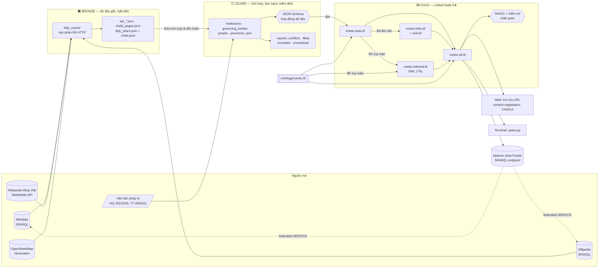

# Kiến trúc dữ liệu (Medallion)

| Tầng | Thư mục | Nội dung | Kiểm soát chất lượng |
|---|---|---|---|
| Bronze | `data/bronze/` | Phản hồi API (cache) + ảnh chụp JSON theo nguồn, kèm `.meta.json` | Tái tạo từ cache; các tệp snapshot được ghi lại, lịch sử do Git lưu |
| Silver | `data/silver/` | Thực thể đã nhận diện, hợp nhất, chuẩn hoá; một bản ghi / thực thể | **JSON Schema** (`schemas/silver.schema.json`), báo cáo mâu thuẫn / giá trị dự phòng / loại bỏ |
| Gold | `data/gold/` | RDF theo ontology, liên kết 5★, suy luận, VoID/DCAT | **SHACL**, kiểm tra nhất quán OWL, kiểm thử suy luận |

`data/manifest.json` ghi lại dòng dõi dữ liệu (lineage): mỗi tệp của mỗi tầng, số bản ghi/triple, SHA-256, thời điểm tạo.
