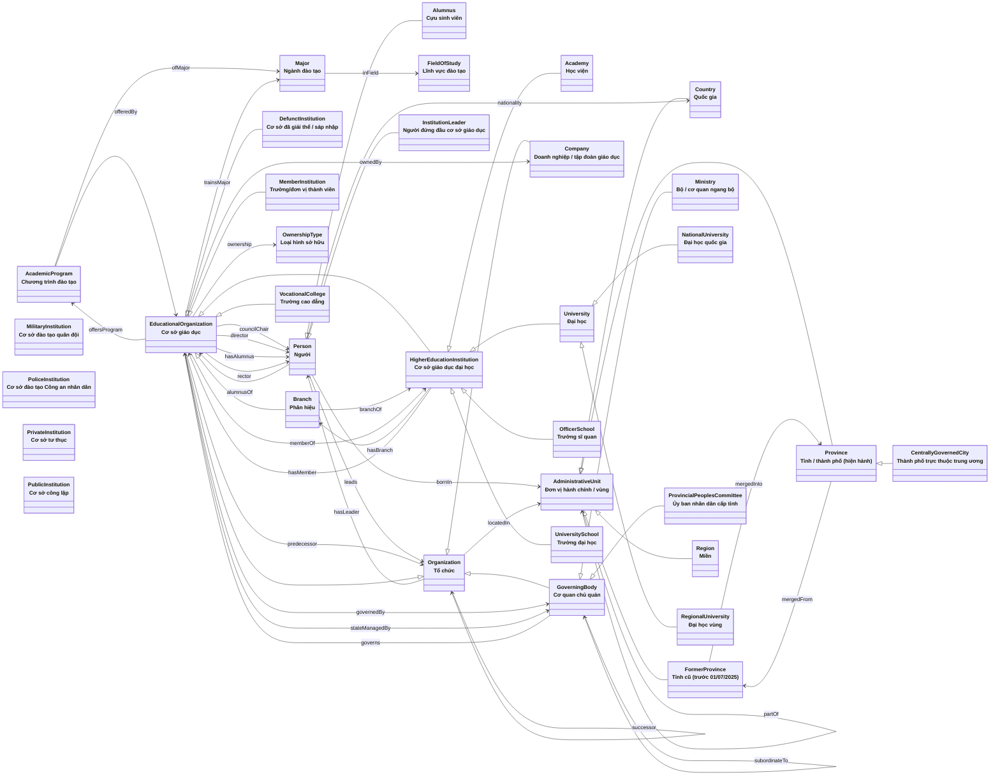

# Sơ đồ ontology VN-Edu

*Sinh tự động từ `ontology/vnedu.ttl` bởi `scripts/gen_docs.py`* — 34 lớp, 33 thuộc tính quan hệ, 20 thuộc tính dữ liệu, 759 triple.

Mũi tên rỗng = kế thừa (`rdfs:subClassOf`); mũi tên có nhãn = thuộc tính quan hệ (domain → range).

## Tiên đề phục vụ suy luận

| Loại tiên đề | Nội dung |
|---|---|
| Lớp định nghĩa (≡) | **MilitaryInstitution** ≡ EducationalOrganization ⊓ ∋governedBy.{MinistryOfNationalDefence} |
| Lớp định nghĩa (≡) | **PoliceInstitution** ≡ EducationalOrganization ⊓ ∋governedBy.{MinistryOfPublicSecurity} |
| Lớp định nghĩa (≡) | **PrivateInstitution** ≡ EducationalOrganization ⊓ ∋ownership.{PrivateOwnership} |
| Lớp định nghĩa (≡) | **PublicInstitution** ≡ EducationalOrganization ⊓ ∋ownership.{PublicOwnership} |
| Phân loại (⊑) | EducationalOrganization ⊓ ∃memberOf.HigherEducationInstitution ⊑ **MemberInstitution** |
| Phân loại (⊑) | Person ⊓ ∃alumnusOf.EducationalOrganization ⊑ **Alumnus** |
| Phân loại (⊑) | Person ⊓ ∃leads.EducationalOrganization ⊑ **InstitutionLeader** |
| Chuỗi thuộc tính | bornIn ∘ mergedInto ⊑ **bornIn** |
| Chuỗi thuộc tính | bornIn ∘ partOf ⊑ **bornIn** |
| Chuỗi thuộc tính | governedBy ∘ subordinateTo ⊑ **governedBy** |
| Chuỗi thuộc tính | locatedIn ∘ partOf ⊑ **locatedIn** |
| Chuỗi thuộc tính | locatedIn ∘ mergedInto ⊑ **locatedIn** |
| Chuỗi thuộc tính | offersProgram ∘ ofMajor ⊑ **trainsMajor** |
| Bắc cầu | **partOf** |
| Bắc cầu | **subordinateTo** |
| Hàm (tối đa 1 giá trị) | **birthDate** |
| Hàm (tối đa 1 giá trị) | **branchOf** |
| Hàm (tối đa 1 giá trị) | **dissolutionYear** |
| Hàm (tối đa 1 giá trị) | **foundingYear** |
| Hàm (tối đa 1 giá trị) | **mergedInto** |
| Hàm (tối đa 1 giá trị) | **ofMajor** |
| Hàm (tối đa 1 giá trị) | **offeredBy** |
| Hàm (tối đa 1 giá trị) | **ownership** |
| Nghịch đảo | **alumnusOf** ⇄ **hasAlumnus** |
| Nghịch đảo | **branchOf** ⇄ **hasBranch** |
| Nghịch đảo | **governedBy** ⇄ **governs** |
| Nghịch đảo | **leads** ⇄ **hasLeader** |
| Nghịch đảo | **memberOf** ⇄ **hasMember** |
| Nghịch đảo | **mergedInto** ⇄ **mergedFrom** |
| Nghịch đảo | **offersProgram** ⇄ **offeredBy** |
| Nghịch đảo | **partOf** ⇄ **hasPart** |
| Nghịch đảo | **predecessor** ⇄ **successor** |
| Rời nhau | University ⊥ UniversitySchool ⊥ Academy ⊥ OfficerSchool |
| Rời nhau | HigherEducationInstitution ⊥ Branch ⊥ VocationalCollege |
| Rời nhau | EducationalOrganization ⊥ GoverningBody ⊥ Company |
| Rời nhau | Country ⊥ Region ⊥ Province ⊥ FormerProvince |
| Rời nhau | Organization ⊥ Person ⊥ AdministrativeUnit |
| Rời nhau | RegionalUniversity ⊥ NationalUniversity |
| Rời nhau | PrivateInstitution ⊥ PublicInstitution |
| Rời nhau | Major ⊥ FieldOfStudy |
