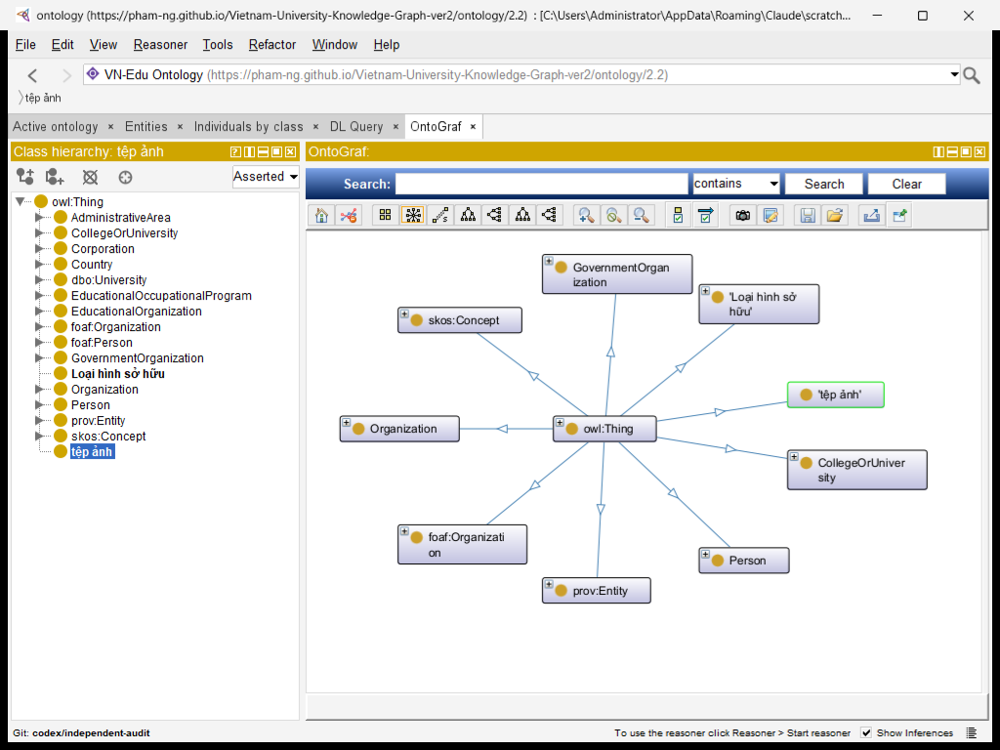
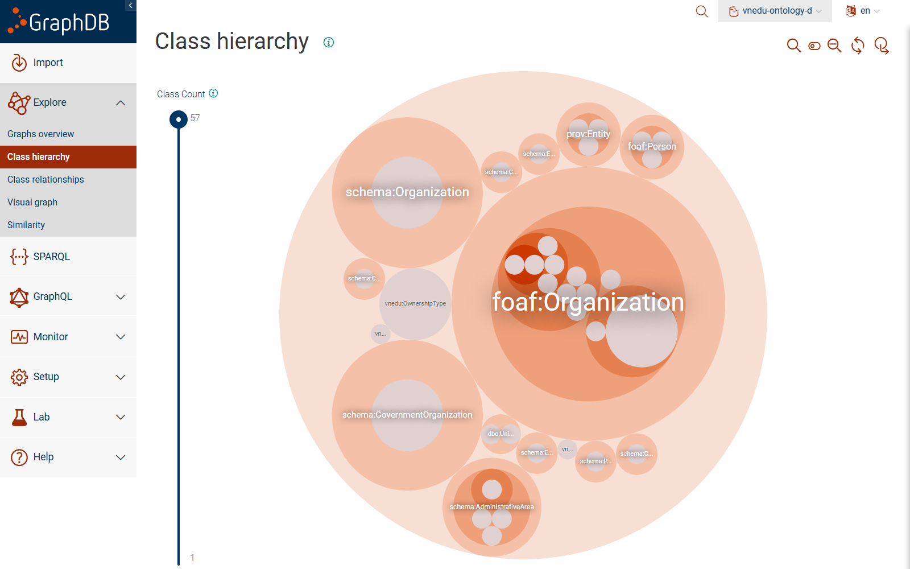
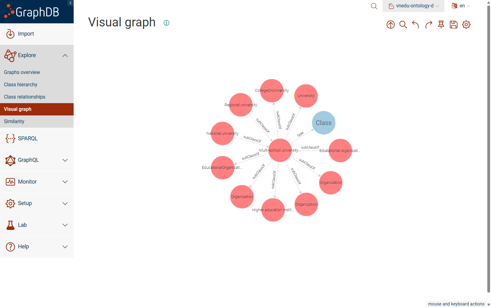
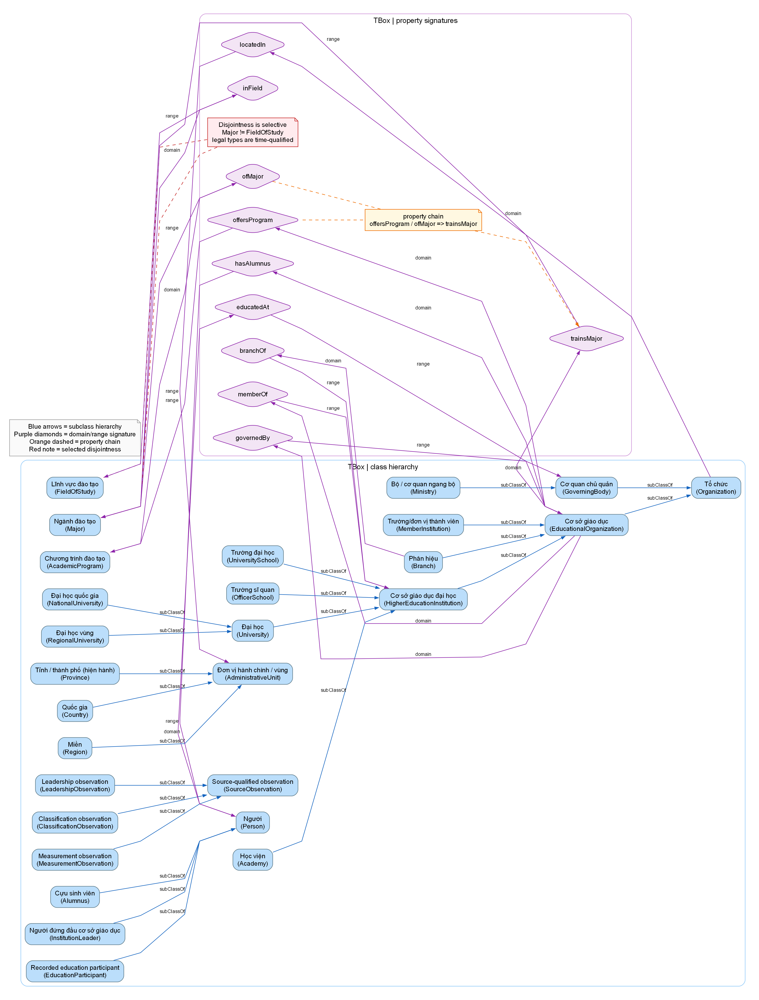
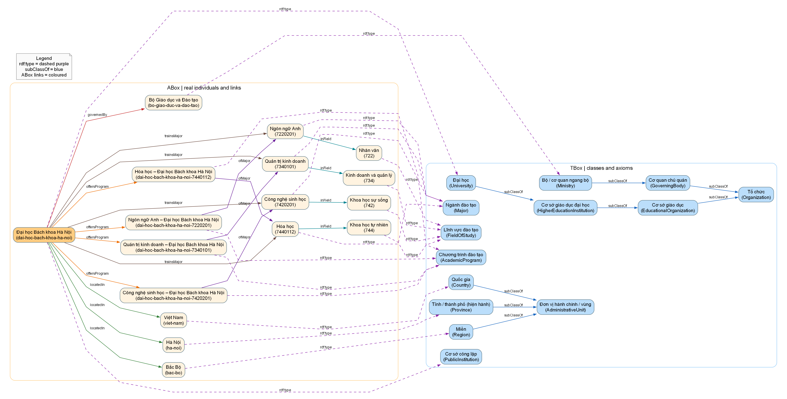
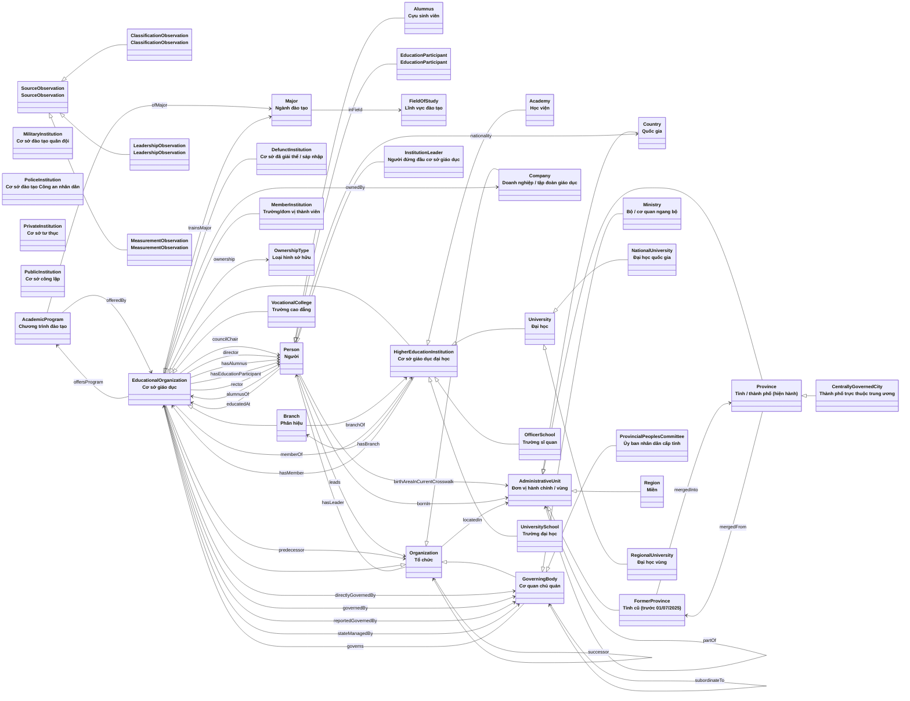

# Sơ đồ ontology VN-Edu

*Sinh tự động từ `ontology/vnedu.ttl` bởi `scripts/gen_docs.py`* — 39 lớp, 38 thuộc tính quan hệ, 27 thuộc tính dữ liệu, 862 triple.

Release 2.2 passes the OWL API `OWL2RLProfile` gate with zero violations; see `data/reports/owl2rl-profile.txt`.

Mũi tên rỗng = kế thừa (`rdfs:subClassOf`); mũi tên có nhãn = thuộc tính quan hệ (domain → range).

The same committed `ontology/vnedu.ttl` was also loaded into GraphDB Workbench 11.1.0
(`vnedu-ontology-d`) for a repository-backed view. The class-hierarchy view reports 57
classes, while the visual graph below focuses on `vnedu:University` and its asserted
superclass/alignment links. These are direct screenshots of GraphDB, not generated
illustrations.

## TBox–ABox view

The repository-backed view is now also populated with the serving union
`data/gold/vnedu-all.ttl`, not only the ontology file. In the local GraphDB repository
`vnedu-ontology-d`, the verified SPARQL count is 74,972 total statements: 73,794 explicit
and 1,178 inferred statements. The saved visual configuration
`VN-Edu TBox-ABox instance neighborhood` starts at the real individual
`resource/university/dai-hoc-bach-khoa-ha-noi` and exposes its most-specific types,
governance, location, programmes, majors and fields.

The schema and instance layers are intentionally separated in the report. The TBox view
shows the multi-level class hierarchy plus domain–property–range signatures and the
`offersProgram / ofMajor => trainsMajor` chain. The ABox view shows named individuals and
their asserted or materialized links. A dashed `rdf:type` edge is a typing assertion or
entailment; it is not a relational foreign key. Domain and range provide OWL semantic
typing, while cardinality, datatype, temporal and completeness rules are checked by
SHACL.

## Tiên đề phục vụ suy luận

| Loại tiên đề | Nội dung |
|---|---|
| Lớp định nghĩa (≡) | **MilitaryInstitution** ≡ EducationalOrganization ⊓ ∋governedBy.{MinistryOfNationalDefence} |
| Lớp định nghĩa (≡) | **PoliceInstitution** ≡ EducationalOrganization ⊓ ∋governedBy.{MinistryOfPublicSecurity} |
| Lớp định nghĩa (≡) | **PrivateInstitution** ≡ EducationalOrganization ⊓ ∋ownership.{PrivateOwnership} |
| Lớp định nghĩa (≡) | **PublicInstitution** ≡ EducationalOrganization ⊓ ∋ownership.{PublicOwnership} |
| Phân loại (⊑) | EducationalOrganization ⊓ ∃memberOf.HigherEducationInstitution ⊑ **MemberInstitution** |
| Phân loại (⊑) | EducationalOrganization ⊓ ∃dissolutionYear.integer ⊑ **DefunctInstitution** |
| Phân loại (⊑) | Person ⊓ ∃alumnusOf.EducationalOrganization ⊑ **Alumnus** |
| Phân loại (⊑) | Person ⊓ ∃leads.EducationalOrganization ⊑ **InstitutionLeader** |
| Chuỗi thuộc tính | bornIn ∘ mergedInto ⊑ **birthAreaInCurrentCrosswalk** |
| Chuỗi thuộc tính | bornIn ∘ partOf ⊑ **birthAreaInCurrentCrosswalk** |
| Chuỗi thuộc tính | birthAreaInCurrentCrosswalk ∘ partOf ⊑ **birthAreaInCurrentCrosswalk** |
| Chuỗi thuộc tính | governedBy ∘ subordinateTo ⊑ **governedBy** |
| Chuỗi thuộc tính | locatedIn ∘ partOf ⊑ **locatedIn** |
| Chuỗi thuộc tính | locatedIn ∘ mergedInto ⊑ **locatedIn** |
| Chuỗi thuộc tính | offersProgram ∘ ofMajor ⊑ **trainsMajor** |
| Bắc cầu | **partOf** |
| Bắc cầu | **subordinateTo** |
| Hàm (tối đa 1 giá trị) | **birthDate** |
| Hàm (tối đa 1 giá trị) | **branchOf** |
| Hàm (tối đa 1 giá trị) | **dissolutionYear** |
| Hàm (tối đa 1 giá trị) | **foundingYear** |
| Hàm (tối đa 1 giá trị) | **mergedInto** |
| Hàm (tối đa 1 giá trị) | **ownership** |
| Nghịch đảo | **alumnusOf** ⇄ **hasAlumnus** |
| Nghịch đảo | **branchOf** ⇄ **hasBranch** |
| Nghịch đảo | **educatedAt** ⇄ **hasEducationParticipant** |
| Nghịch đảo | **governedBy** ⇄ **governs** |
| Nghịch đảo | **leads** ⇄ **hasLeader** |
| Nghịch đảo | **memberOf** ⇄ **hasMember** |
| Nghịch đảo | **mergedInto** ⇄ **mergedFrom** |
| Nghịch đảo | **offersProgram** ⇄ **offeredBy** |
| Nghịch đảo | **partOf** ⇄ **hasPart** |
| Nghịch đảo | **predecessor** ⇄ **successor** |
| Rời nhau | HigherEducationInstitution ⊥ Branch ⊥ VocationalCollege |
| Rời nhau | EducationalOrganization ⊥ GoverningBody ⊥ Company |
| Rời nhau | Country ⊥ Region ⊥ Province ⊥ FormerProvince |
| Rời nhau | Organization ⊥ Person ⊥ AdministrativeUnit |
| Rời nhau | RegionalUniversity ⊥ NationalUniversity |
| Rời nhau | PrivateInstitution ⊥ PublicInstitution |
| Rời nhau | Major ⊥ FieldOfStudy |
